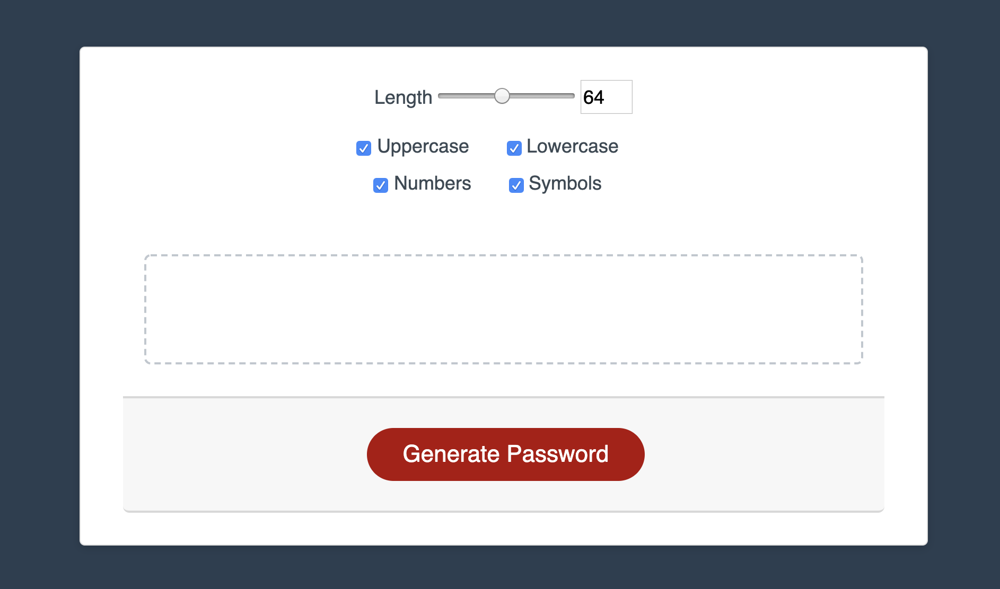

## Password Generator

Choose a password between 8-128 characters in lengths

Password can contain 4 variables: Uppercase, Lowercase, Numbers, and Symbols

## Links
[***CLICK HERE FOR THE APP***](https://waltribeiro.github.io/password-generator/)

## Contact
If you like this app and want me to build one for you, then contact me at w@waltrib.com

I have other apps over at my [Github](http://waltrib.com)

> The best thing about a boolean is even if you are wrong, you are only off by a bit.

## Screenshot
